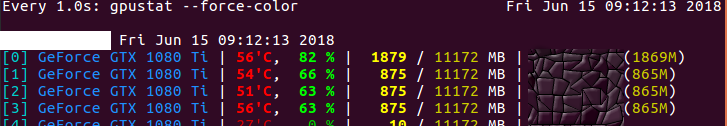

# 实验环境
+ python3.5
+ pytorch 0.4
+ ubuntu16.04

---

> 4GPU运行，batch_size过大可能出现溢出 



# 多GPU

`torch.nn.DataParallel`: torch多GPU

查看DataParallel定义: `class DataParallel(Module):` DataParallel是Module子类
在本实验中自定义了`models/BasicModule`扩展了save/load方法，因此定义了MulGPUDataParallel类

```
class MulGPUDataParallel(DataParallel, BasicModule):
    pass
```

存在的问题：

1. 模型保存的命名有误(eg: ` <class 'models.mul_gpu.MulGPUDataParallel'>_0615_09:53:32.pth`)，原始代码默认按照 model_name + time 进行保存，这里自定义了MulGPUDataParallel 之后，原始的model_name 发生了改变。

可能的解决方法： 1）直接定义 BasicModule.model_name  2） 或者考虑在MulGPUDataParallel类中获取相关的model_name

---

# PyTorch 实践指南 


本文是文章[PyTorch实践指南](https://zhuanlan.zhihu.com/p/29024978)配套代码，请参照[知乎专栏原文](https://zhuanlan.zhihu.com/p/29024978)或者[对应的markdown文件](PyTorch实战指南.md)更好的了解而文件组织和代码细节。

## 本部分内容属于 《深度学习框架PyTorch：入门与实践》一部分, 关于该书的源码，以及更多案例，请查看[github](https://github.com/chenyuntc/pytorch-book)

## 数据下载
- 从[kaggle比赛官网](https://www.kaggle.com/c/dogs-vs-cats/data) 下载所需的数据
- 解压并把训练集和测试集分别放在一个文件夹中


## 安装
- PyTorch : 可按照[PyTorch官网](http://pytorch.org)的指南，根据自己的平台安装指定的版本
- 安装指定依赖：

```
pip install -r requirements.txt
```

## 训练
必须首先启动visdom：

```
python -m visdom.server
```

然后使用如下命令启动训练：

```
# 在gpu0上训练,并把可视化结果保存在visdom 的classifier env上
python main.py train --data-root=./data/train --use-gpu=True --env=classifier
```


详细的使用命令 可使用
```
python main.py help
```

## 测试

```
python main.py --data-root=./data/test --use-gpu=False --batch-size=256
```
